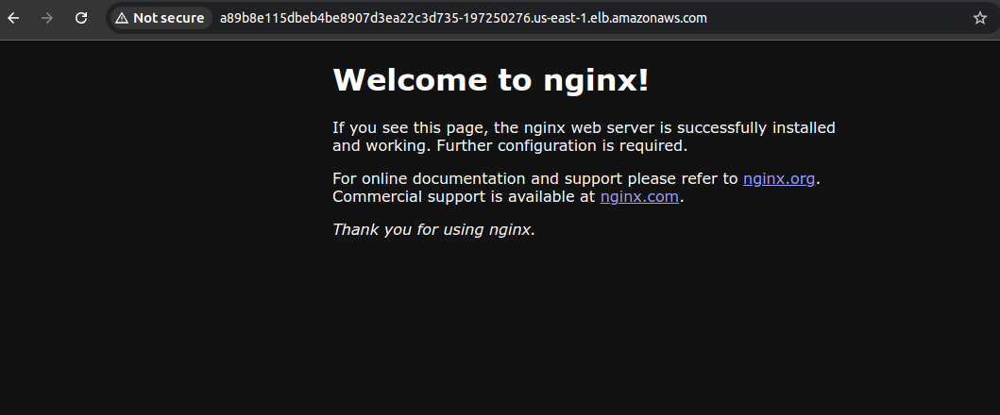
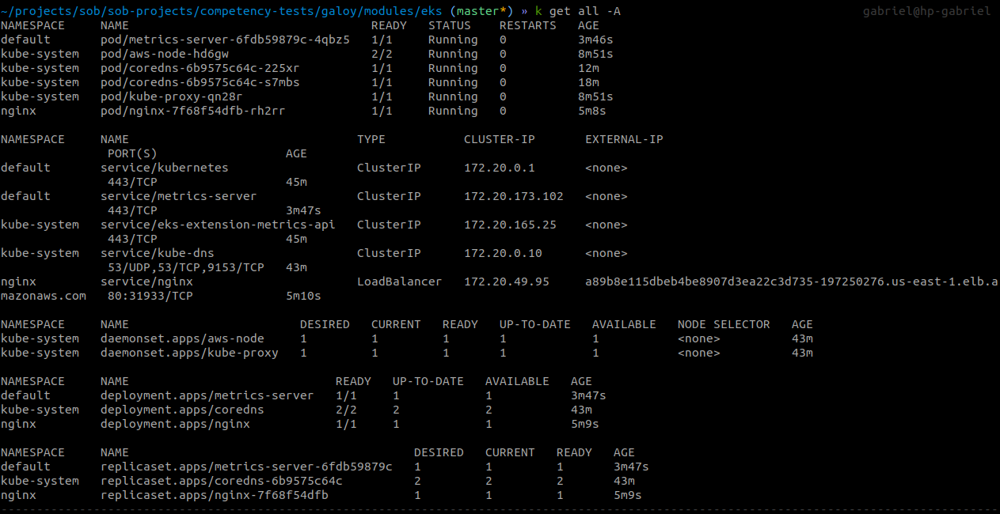
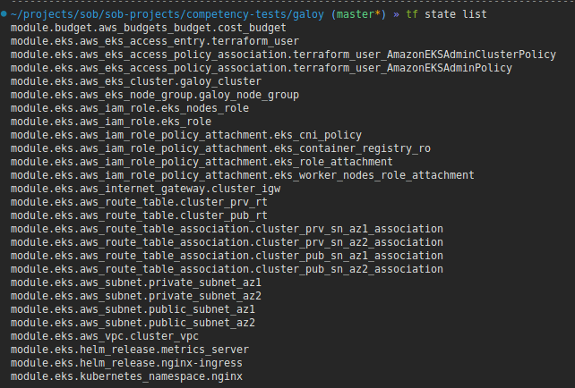
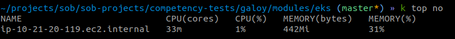
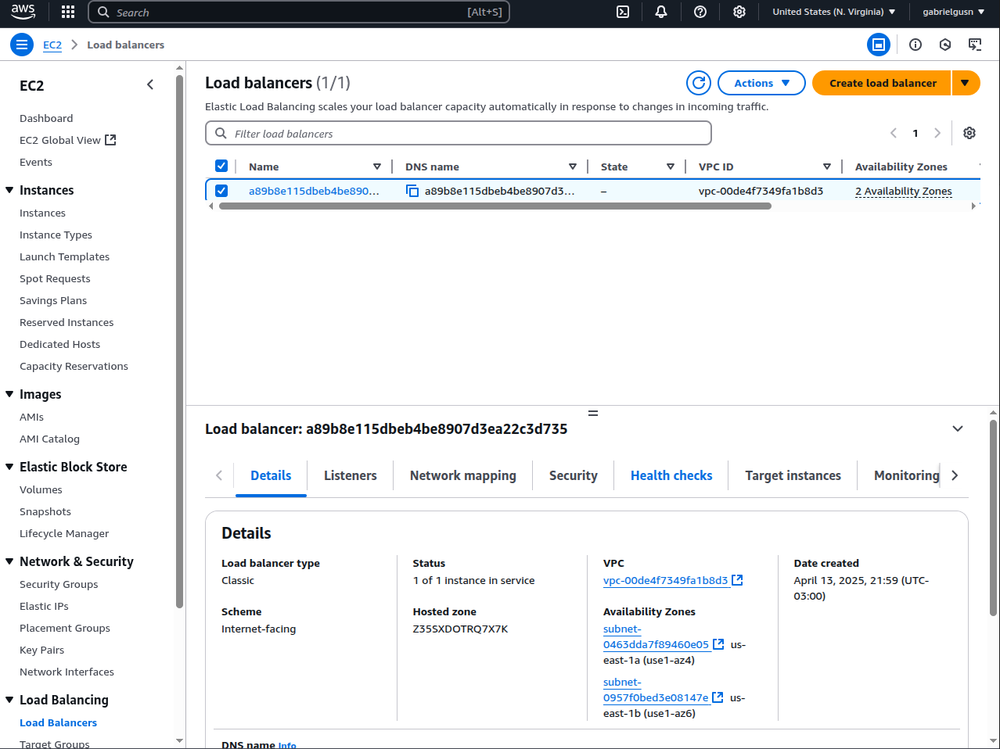
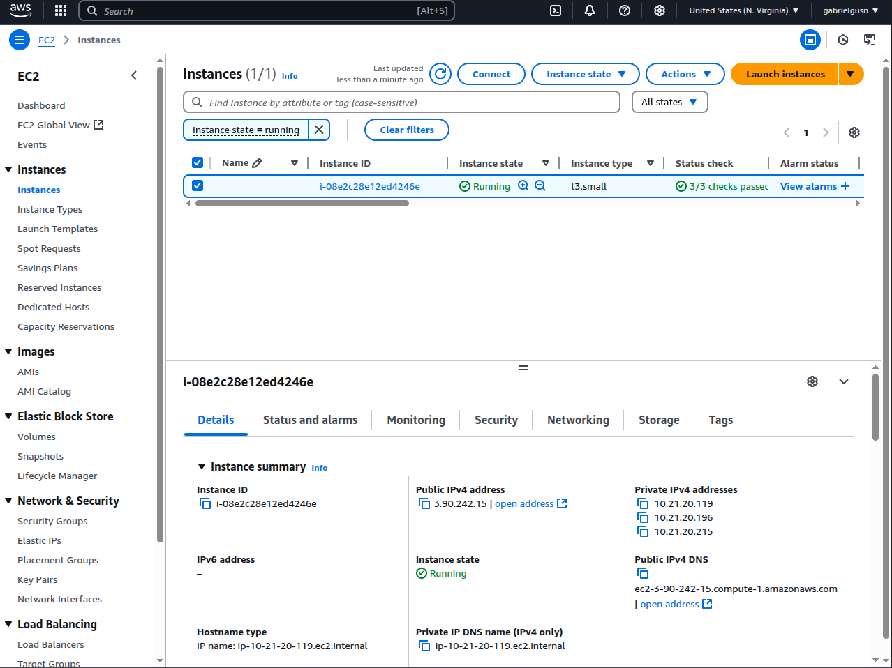
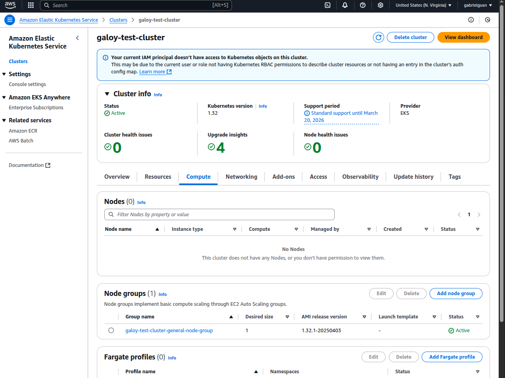
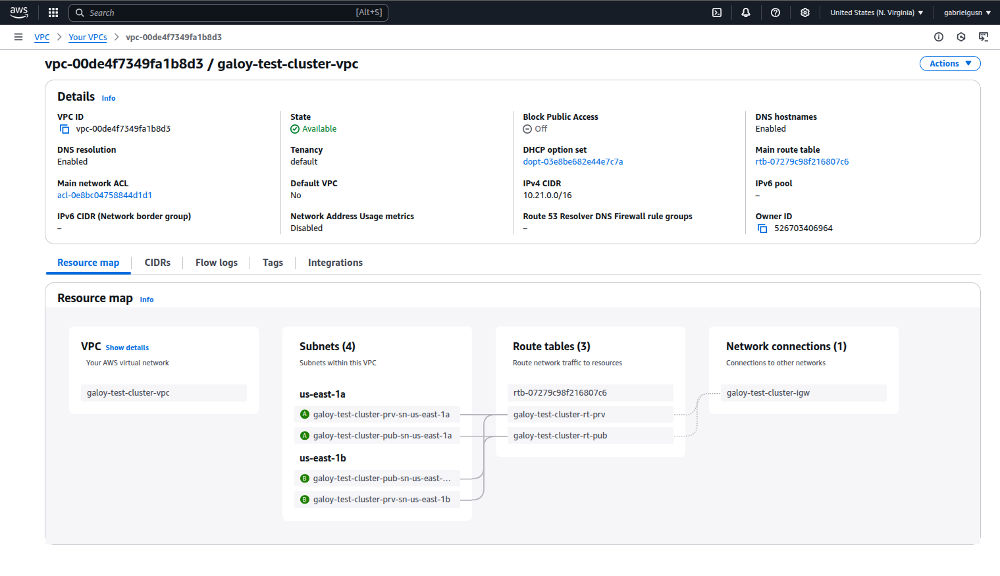
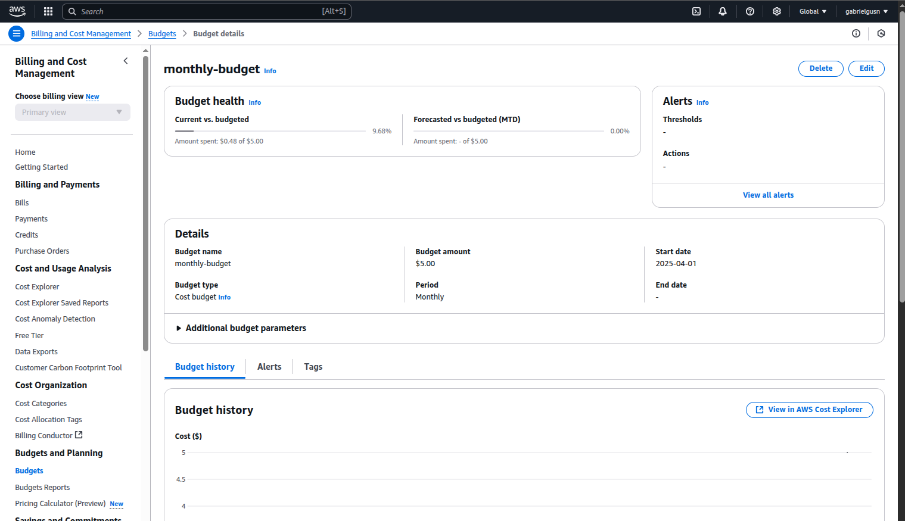

# Galoy project: Add AWS to Galoy-Infra

## How to run the competency test:

> Requirements:
> - An AWS account with permission to create EC2, S3, IAM, VPC, Budgets and EKS resources.
> - AWS CLI installed.
> - Create an IAM User named `terraform` and attach a policy with the following permissions:
> ```json 
>  {
>     "Version": "2012-10-17",
>     "Statement": [
>         {
>             "Effect": "Allow",
>             "Action": [
>                 "budgets:ListTagsForResource",
>                 "budgets:ModifyBudget",
>                 "budgets:ViewBudget"
>             ],
>             "Resource": "*"
>         },
>         {
>             "Effect": "Allow",
>             "Action": [
>                 "ec2:AssociateRouteTable",
>                 "ec2:AttachInternetGateway",
>                 "ec2:AuthorizeSecurityGroupEgress",
>                 "ec2:AuthorizeSecurityGroupIngress",
>                 "ec2:CreateRoute",
>                 "ec2:CreateRouteTable",
>                 "ec2:CreateSecurityGroup",
>                 "ec2:CreateSubnet",
>                 "ec2:CreateVpc",
>                 "ec2:DeleteKeyPair",
>                 "ec2:DeleteInternetGateway",
>                 "ec2:DeleteRouteTable",
>                 "ec2:DeleteSecurityGroup",
>                 "ec2:DeleteSubnet",
>                 "ec2:DeleteVpc",
>                 "ec2:DescribeInstanceCreditSpecifications",
>                 "ec2:DescribeInstanceTypes",
>                 "ec2:DescribeInstances",
>                 "ec2:DescribeInternetGateways",
>                 "ec2:DescribeKeyPairs",
>                 "ec2:DescribeNetworkAcls",
>                 "ec2:DescribeNetworkInterfaces",
>                 "ec2:DescribeRouteTables",
>                 "ec2:DescribeSecurityGroups",
>                 "ec2:DescribeSubnets",
>                 "ec2:DescribeTags",
>                 "ec2:DescribeVolumes",
>                 "ec2:DescribeVpcAttribute",
>                 "ec2:DescribeVpcs",
>                 "ec2:DetachInternetGateway",
>                 "ec2:DisassociateRouteTable",
>                 "ec2:ModifyInstanceAttribute",
>                 "ec2:ModifyVpcAttribute",
>                 "ec2:RevokeSecurityGroupEgress",
>                 "ec2:RunInstances",
>                 "ec2:TerminateInstances",
>                 "ec2:CreateInternetGateway",
>                 "ec2:CreateTags",
>                 "ec2:DescribeInstanceAttribute",
>                 "ec2:ImportKeyPair",
>                 "ec2:ModifySubnetAttribute"
>             ],
>             "Resource": "*"
>         },
>         {
>             "Effect": "Allow",
>             "Action": [
>                 "eks:AssociateAccessPolicy",
>                 "eks:DeleteAccessEntry",
>                 "eks:DescribeAccessEntry",
>                 "eks:DisassociateAccessPolicy",
>                 "eks:CreateAccessEntry",
>                 "eks:CreateCluster",
>                 "eks:CreateNodegroup",
>                 "eks:DeleteNodegroup",
>                 "eks:DeleteCluster",
>                 "eks:DescribeCluster",
>                 "eks:DescribeNodegroup",
>                 "eks:ListAssociatedAccessPolicies"
>             ],
>             "Resource": "*"
>         },
>         {
>             "Effect": "Allow",
>             "Action": [
>                 "iam:AttachRolePolicy",
>                 "iam:CreateRole",
>                 "iam:DeleteRole",
>                 "iam:DetachRolePolicy",
>                 "iam:GetRole",
>                 "iam:ListAttachedRolePolicies",
>                 "iam:ListInstanceProfilesForRole",
>                 "iam:ListRolePolicies",
>                 "iam:PassRole",
>                 "sts:GetCallerIdentity"
>             ],
>             "Resource": "*"
>         },
>         {
>             "Effect": "Allow",
>             "Action": "ssm:GetParameters",
>             "Resource": "*"
>         },
>         {
>             "Effect": "Allow",
>             "Action": "s3:*",
>             "Resource": "*"
>         }
>     ]
> }
> ```
> You will also need to configure this user locally on your computer using the CLI.

### First Step:
Enter the "galoy" directory, which contains the `main.tf` and `backend.tf` files, then run:
```sh
terraform init
```

### Second Step:
Run the terraform plan and apply commands
```sh
terraform plan --out plan
```
Review the resources that are going to be created on AWS and then run:
```sh
terraform apply "plan"
```


## Screenshots of some of the resources created by this terraform project:
















